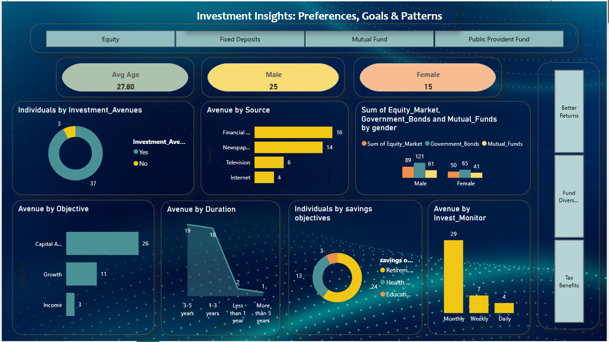
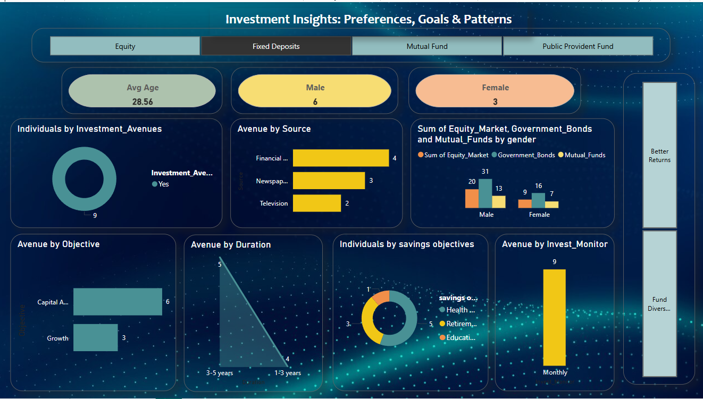
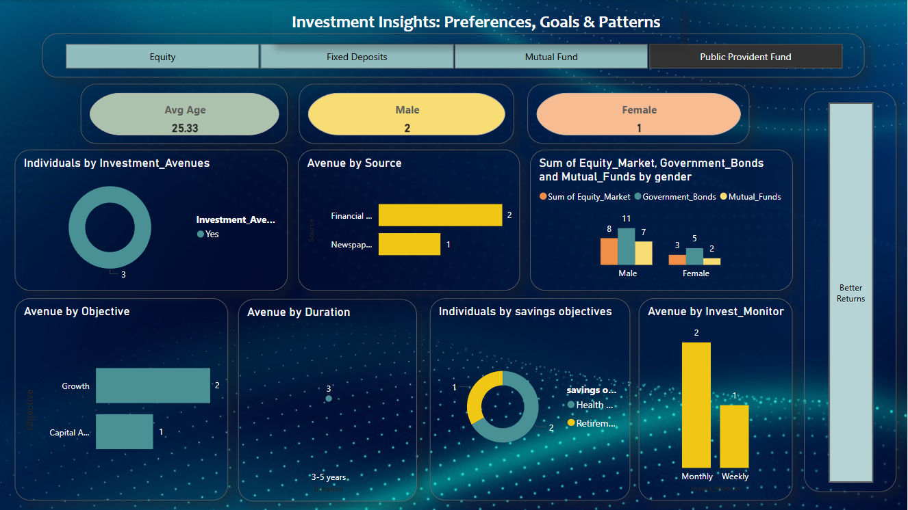

# 📊 Investment Analysis Dashboard

An interactive Power BI dashboard that analyzes investment behaviors and preferences using Excel data. This project uncovers trends based on gender, savings objectives, investment duration, and monitoring frequency, offering insights to help understand how different factors influence financial decision-making.

---

## 🔍 Project Overview

This dashboard was built using Microsoft Power BI and Excel to visualize and analyze:

- **Gender-based investment choices** (Equity, Mutual Funds, Government Bonds)
- **Correlation between savings objectives** and preferred investment avenues
- **Distribution of investment durations**
- **Impact of monitoring frequency** on investment behavior

The dashboard integrates DAX calculations, slicers, and custom visuals to ensure user interactivity and data-driven storytelling.

---

## 🛠️ Tools & Technologies

- **Power BI**
- **Microsoft Excel**
- **DAX (Data Analysis Expressions)**

---

## 📁 Dataset

The dataset includes information such as:

- Gender
- Age
- Investment Avenues (Equity, Mutual Funds, Government Bonds)
- Savings Objectives
- Investment Duration
- Monitoring Frequency

---

## 📸 Dashboard Screenshots

> ✨ Replace the placeholder below with actual images once you take screenshots from Power BI.

### 🔹 Overall Dashboard  

### 🔹 Equity analysis

### 🔹FD analysis  

### 🔹Mutual Fund analysis  

### 🔹PPF analysis  

---

## 📈 Key Insights

- **Gender Trends**: Males showed a stronger preference for equity investments, while females leaned toward mutual funds and government schemes.
- **Objective Link**: Capital appreciation was strongly tied to equity investments, while wealth preservation leaned toward bonds.
- **Monitoring Frequency**: Frequent monitoring correlated with more aggressive investment choices.
- **Investment Duration**: Short-term investments were more common, especially among younger demographics.

---

## 🚀 How to Use

1. Download the Power BI file (.pbix)
2. Open in Power BI Desktop
3. Interact with filters, slicers, and visuals to explore insights

---

## 📚 About This Project

This project was created to demonstrate data visualization, storytelling, and analytical skills using Power BI. It is suitable for showcasing business intelligence capabilities in resumes, portfolios, or interview presentations.

---
